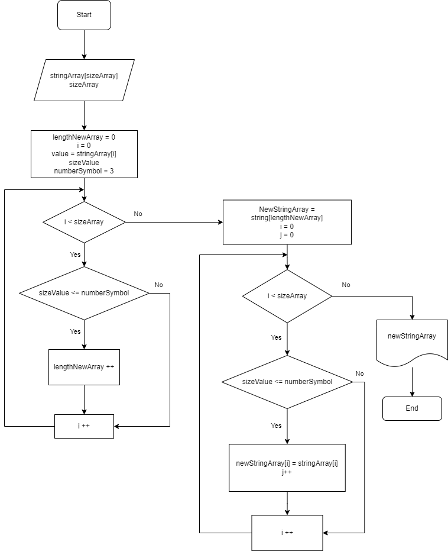

# Контрольная работа
1. Создать репозиторий на GitHub
2. Нарисовать блок схему алгоритма
3. Снабдить репозиторий оформленным текстовым описанием (файл README.md)
4. Написать программу, решающую поставленную задачу
5. Использовать контроль версий в работе над этим небольшим проектом (не должно быть так что все залито одним коммитом, как минимум этап 2, 3 и 4 должны быть расположены в разных коммитах)

## Результат

1. ### Создать репозиторий на GitHub

    Ссылка на репозиторий: https://github.com/AlekseyVychuzhanin/FinalTask

2. ### Нарисовать блок схему алгоритма

    Блок схема алгоритма: 

    *В решении задачи используется 3 метода.*

    **CreateUserStringArray** - создает первоначальный массив.
    
    **CreateStringArray** - основной метод. Первый цикл определяет размер нового массива, состоящий из элементов, количество символов которого меньше либо равно 3. Второй цикл заполняет новый массив этими элементами.
    
    **PrintStringArray** - выводит основной и полученный массивы в консоль.

3. ### Снабдить репозиторий оформленным текстовым описанием (файл README.md)

    Ссылка на файл README.md: https://github.com/AlekseyVychuzhanin/FinalTask/blob/main/README.md

